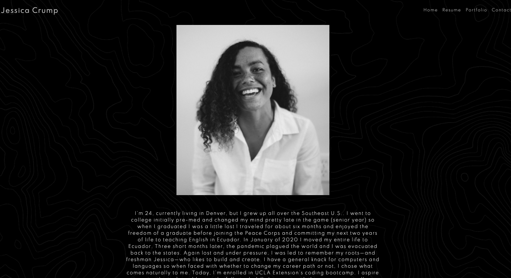
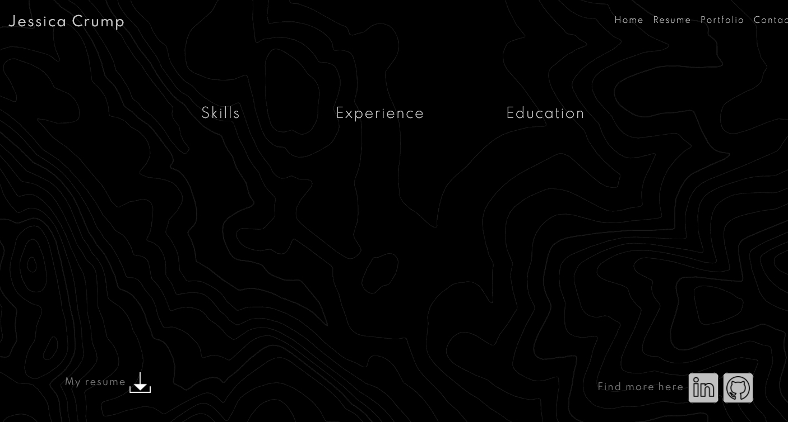
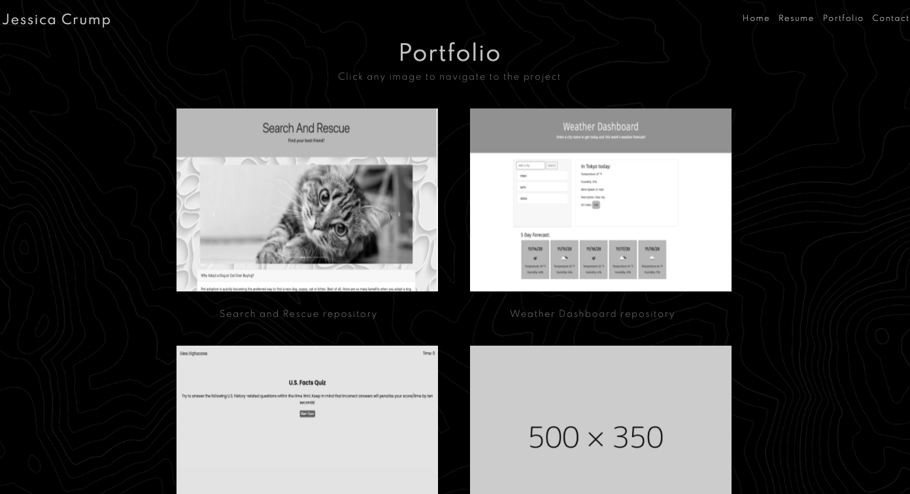
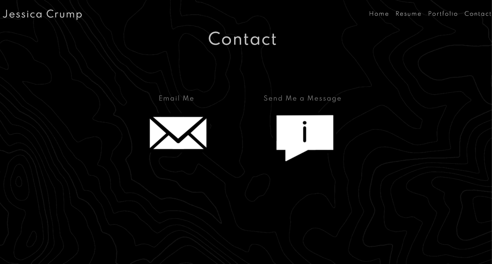

# Jessica's Portfolio 

## Table of Contents 

* [Installation](#installation)
* [Usage](#usage)
* [Credits](#credits)
* [License](#license)
* [Contributing](#contributing)

## Installation 

No installation necessary. The site can be accessed here: https://jesscru.github.io/portfolio/.

## Usage 

This portfolio serves to compile and showcase my professional abilities. It is a place to learn a bit about me, view some of my strengths, and contact me in a number of places. It is kept up to do date with my latest work as learn more and grow! 
    
Below is what the viewer will see upon visiting each tab of the site. 

### Home Tab

### Resume Tab

### Portfolio Tab

### Contact Tab

## Credits

Some of the projects on the portfolio page were team efforts and their respective repostitory pages appropriately reflect the contributors. 

Icons used on the Contact page were found on [IconFinder](https://www.iconfinder.com) 

* The designer for the social icons: [Alexei Ryazancev](https://www.iconfinder.com/GlumPix)

* The designer for the download and message icons: [Stefan Taubert](https://www.iconfinder.com/stefantaubert)

* Background image: https://www.google.com/url?sa=i&url=https%3A%2F%2Fcutewallpaper.org%2F21%2Fblack-texture-background-hd%2Fview-page-21.html&psig=AOvVaw3BxV8YF4f-mKZW8NWuVNt3&ust=1605849527829000&source=images&cd=vfe&ved=0CAMQjB1qFwoTCNiZ9O7tje0CFQAAAAAdAAAAABAX

* Placeholder image: https://dummyimage.com/500x350

The page is hosted by Github Pages. 

## License 

This project has an MIT license.

## Contributing

I welcome any ideas anyone might have to contribute to this project. Please reach me at the email below if you have suggestions or ideas you'd like to add to the project. 

## Questions 

Github username: jesscru

Github repository page: github.com/jesscru

If you have additonal questions or comments you can reach me at my email: jessicacrump7@gmail.com

